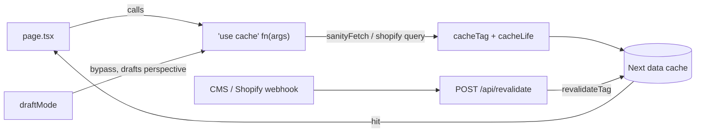

# Architecture Guide

Key architectural decisions and patterns for teams working with this codebase.

## Core Decisions

### React Compiler (No Manual Memoization)

React Compiler is enabled — no `useMemo`, `useCallback`, or `React.memo`. See AGENTS.md § No manual memoization.

### CSS Modules + Tailwind

Tailwind for layout/spacing/color; CSS Modules for complex animations and custom layouts. See AGENTS.md § Styling split.

### Custom Image/Link Components

Always use these, never native HTML:

```tsx
import { Image } from '@/components/ui/image'
import { Link } from '@/components/ui/link'
```

**Why?**

- Image: Optimization, aspect ratios, WebGL integration
- Link: External detection, prefetching, consistent behavior

### Lenis for Scrolling

Enabled per page through `<Wrapper lenis>` (`components/layout/wrapper/index.tsx`), which also syncs ScrollTrigger.

### Optional Features Pattern

The app layout (`app/(site)/layout.tsx`) conditionally loads features:

```tsx
import { OptionalFeatures } from '@/lib/features'
;<OptionalFeatures /> // Only loads WebGL, dev tools when needed
```

### Linting and Formatting (oxc)

`oxlint` lints, `oxfmt` formats. One toolchain, one editor extension (`oxc.oxc-vscode`), one pre-commit hook.

```bash
bun lint             # oxlint
bun lint:fix         # oxlint, auto-fix
bun lint:types       # type-aware rules (not in the pre-commit hook)
bun run format       # oxfmt, writes in place
bun run check        # oxlint + oxfmt --check + lint:types + ensure:typegen + tsc --noEmit + bun test + test:oxlint-plugin + manifest:check + check:assets (must pass before pushing)
```

**Why?**

- **Sorting is a formatting concern, not a lint error.** `oxfmt` sorts imports and Tailwind classes on format or save, so they fix themselves instead of failing `bun lint`.
- **One formatter for the whole repo.** Markdown, YAML, and TOML are formatted alongside TS/TSX/CSS, so docs and workflows stop drifting from house style.
- **Type-aware linting.** `bun lint:types` reads the TypeScript program to catch un-awaited promises and async handlers passed where a void return is expected — bugs a syntax-only linter cannot see. It runs in `bun run check` and CI but stays out of the pre-commit hook, so commits stay fast.

**Trade-off:** oxlint has no CSS parser, so there is no CSS _linting_. `oxfmt` still formats stylesheets, CSS Modules and Tailwind v4 at-rules included, except the generated `lib/styles/css/tailwind.css` and `root.css`, which are deliberately left to their generator.

Config lives in `oxlint.config.ts` and `oxfmt.config.ts` rather than JSON, so `bun run typecheck` covers it and each choice carries a comment. That catches invalid severities and duplicate rule keys, which a JSON config accepts silently; rule _names_ are still a permissive `Record`, so a typo'd rule name slips through either way. House style is pinned explicitly (80 columns, 2-space indent, single quotes, semicolons only where required) because oxfmt's own defaults differ. A vendored anti-slop plugin is loaded from `tools/oxlint/anti-slop` for custom rules. See AGENTS.md § Enforced Rules for the rule-by-rule list.

## Cache Components (Next.js 16)

Data is fetched inside `'use cache'` functions that call `cacheTag()` and `cacheLife()`. A CMS or Shopify webhook hits `POST /api/revalidate`, which calls `revalidateTag()` to drop the matching cache entries. `draftMode` bypasses the cache entirely so editors always see live content. `cacheTag()` is only legal inside a `'use cache'` function — wrap the fetch in a small helper, not the page that calls it.



See AGENTS.md § Next.js 16 Cache Components for the critical rules and an example.

## WebGL Architecture

A single root canvas (`<Canvas root>`) hosts the scene; content is portalled in
with `<WebGLTunnel>`. Two mutually-exclusive strategies — pick one:

```
Shared (default):  Root Layout → <Canvas root> (lazy via lib/features)
Per page:          <Wrapper webgl> → <Canvas root>

    └─ WebGLTunnel (portals 3D content)
        └─ Your 3D scene
```

The shared strategy keeps the context alive across navigation; the per-page
strategy remounts it per route. Rendered only on WebGL-capable devices. See
[lib/webgl/README.md](lib/webgl/README.md).

## Animation

Use `useReveal` (CSS-driven, compositor thread) for reveal-on-scroll and entrance animations. Reserve GSAP for orchestration, scrubbing, and pinning. Always honor `prefers-reduced-motion` — `useReveal` short-circuits automatically; CSS global neutralizer is in `global.css`. See AGENTS.md § Animation.

Directory layout: see `README.md` § Project Structure.

## Boundaries

### Validation Layer

Zod schemas provide type-safe validation at three boundaries:

1. **Environment variables** -- Per-integration schemas validate config via the registry (`isConfigured()`) and `doctor.ts`
2. **Server actions** -- `parseFormData()` validates FormData before processing (HubSpot, Mailchimp, Shopify)
3. **Client forms** -- `zodToValidator()` bridges the same Zod schemas to the form hook's client-side validation

Env and form schemas live in `lib/utils/validation.ts`; integration-local response schemas live next to their client (`lib/integrations/hubspot/schema.ts`, `lib/integrations/shopify/schemas.ts`). The typed env singleton (`lib/env.ts`) provides IntelliSense for `process.env` access.

### Request Proxy

`proxy.ts` handles cross-cutting concerns (rate limiting for `/api/*`). See AGENTS.md for usage guidance.

## Deployment Checklist

- [ ] Environment variables configured
- [ ] Build passes (`bun run build`)
- [ ] Webhooks configured (Sanity, Shopify)
- [ ] Cache invalidation tested
- [ ] Performance score > 90

### Hosting Storybook

Storybook is its own static build, not a Next route. To serve it at `/storybook` on a deployment, create a second Vercel project from this repo (build command `bun run build-storybook`, output directory `storybook-static`), then set `NEXT_PUBLIC_STORYBOOK_URL` to its URL on the **Preview** environment. The app proxies `/storybook` to it there, and keeps the route disabled in Production by design.

## Customization Boundaries

One decision drives how you work in this repo: **are you building your project, or extending the starter?**

- **Building your project** (pages, content, styling): modify freely. `app/` is yours.
- **Extending the starter** (new shared primitives): add alongside the existing ones rather than rewriting them.

This keeps upstream updates smooth. When you create new components instead of modifying starter ones, and keep your pages and content separate from starter utilities, pulling satus updates stays low-conflict. There are no strict folder rules beyond that: `components/` for UI, `lib/` for everything else.

## Code Patterns

### 1. Compound Component

UI primitives wrap `@base-ui/react` with project styling. Two patterns:

**Pattern A - Namespace + named exports** (Accordion, Tabs):

```tsx
'use client'
import { Collapsible } from '@base-ui/react/collapsible'
import cn from 'clsx'
import s from './accordion.module.css'

function Root({ children, className, ...props }: RootProps) {
  return (
    <Collapsible.Root className={cn(s.accordion, className)} {...props}>
      {children}
    </Collapsible.Root>
  )
}

export { Body, Button, Group, Root }
export const Accordion = { Group, Root, Button, Body }
```

**Pattern B - Function properties** (Tooltip, Checkbox, Switch):

```tsx
function Tooltip({ content, children, side = 'top', className }: TooltipProps) {
  /* simple API */
}
Tooltip.Root = BaseTooltip.Root
Tooltip.Popup = Popup
export { Tooltip }
```

Rules: always pass `className` through as `cn(s.root, className)`, spread `{...props}` for extensibility, provide both simple and compound API.

### 2. CSS Modules + Tailwind Hybrid

```tsx
import s from './component.module.css'
import cn from 'clsx'

<div className="flex items-center gap-4 p-2">              {/* Tailwind only */}
<div className={s.animatedPanel}>                           {/* Module only */}
<div className={cn(s.root, 'p-4', className)}>             {/* Combined */}
```

### 3. Context Pattern

Shared contexts (theme, cart, form) use a typed `createContext` with a
`{ state, actions, meta? }` value shape, plus a hook that throws when used
outside the provider. See `components/layout/theme/index.tsx` for the
reference implementation.

```tsx
interface MyState {
  count: number
}
interface MyActions {
  increment: () => void
}
type MyContextValue = { state: MyState; actions: MyActions }

const MyContext = createContext<MyContextValue | null>(null)

function useMyComponent(): MyContextValue {
  const context = use(MyContext)
  if (!context) throw new Error('useMyComponent must be used within MyProvider')
  return context
}

function MyProvider({ children }: PropsWithChildren) {
  const [count, setCount] = useState(0)
  return (
    <MyContext.Provider
      value={{
        state: { count },
        actions: { increment: () => setCount((c) => c + 1) },
      }}
    >
      {children}
    </MyContext.Provider>
  )
}
```

For component-scoped contexts, inline `createContext` + `useContext` is fine.

### 4. Server vs Client Split

```tsx
// product-page.tsx - Server Component (no directive)
export default async function ProductPage({
  params,
}: {
  params: { slug: string }
}) {
  const data = await fetchProduct(params.slug)
  return <ProductView product={data} /> // serializable props only
}

// product-view.tsx - Client Component
;('use client')
export function ProductView({ product }: { product: Product }) {
  const [qty, setQty] = useState(1)
}
```

`'use client'` goes on the first line, before imports.

### 5. Integration Optionality

```tsx
import { isConfigured } from '@/integrations/registry'
import { NotConfigured } from '@/components/ui/not-configured'

export default async function SanityPage() {
  if (!isConfigured('sanity')) {
    return <NotConfigured integration="Sanity" />
  }
  // ... normal page logic
}
```

Available checks: `isConfigured('sanity' | 'shopify' | 'hubspot' | 'mailchimp' | 'turnstile' | 'analytics')`.

Adding a new integration: add its Zod schema to `@/utils/validation`, add one entry to `lib/integrations/registry.ts`. `generate-manifest` and `setup:project` read the registry; `doctor` checks core env only. A removable integration also needs an `INTEGRATION_BUNDLES` entry in `lib/scripts/integration-bundles.ts` (files, deps, transforms, env stubs), or `setup:project` cannot strip it. See `lib/integrations/README.md`.

Validate external API _responses_ at the boundary, not just env config. Pass
untrusted upstream JSON (GraphQL envelopes, REST payloads) through
`parseApiResponse(schema, data, context)` (`@/utils/validation`) so a malformed
response fails clearly at the edge with context instead of crashing downstream.
The Shopify, HubSpot, and Mailchimp clients all do this.

### 6. WebGL Element Lifecycle

DOM-synced WebGL via tunnel system. A single root canvas (`<Canvas root>`)
hosts the scene — mounted either in the shared layout (`lib/features`, persists
across routes) or per page via `<Wrapper webgl>`. Pick one strategy.

```
<Canvas root> (layout OR <Wrapper webgl>) -> WebGLTunnel.Out, DOMTunnel.Out
Page -> <WebGLTunnel> (portals 3D content up into the root canvas)
```

```tsx
// DOM side
'use client'
import { useWebGLElement } from '@/webgl/hooks/use-webgl-element'
import { WebGLTunnel } from '@/webgl/components/tunnel'

function MyWebGLComponent({ className }: { className?: string }) {
  const { setRef, rect, isVisible } = useWebGLElement()
  return (
    <div ref={setRef} className={className}>
      <WebGLTunnel>
        <MyMesh rect={rect} visible={isVisible} />
      </WebGLTunnel>
    </div>
  )
}
```

`WebGLTunnel` (and `DOMTunnel`, for HTML overlays) already wrap `useCanvas()`
internally — this is the intended public API. Reach for `useCanvas()` directly
only as a low-level escape hatch, e.g. building a new portal primitive. See
`lib/webgl/README.md`.

Always dispose GPU resources (materials, textures, geometries, render targets) on unmount.

### 7. useRef for Object Instantiation

```tsx
// Persistent instances (compiler cannot optimize class instantiation)
const instanceRef = useRef<MyClass | null>(null)
if (!instanceRef.current) {
  instanceRef.current = new MyClass()
}

// Three.js objects with cleanup
const [material] = useState(() => new MeshBasicMaterial())
useEffect(() => () => material.dispose(), [material])
```

The compiler handles simple calculations and callbacks automatically - no manual memoization needed.

## Extending

**New component**: `bun run generate` or add to `components/ui/`

**New integration**: Add Zod env schema in `@/utils/validation`, add entry in `lib/integrations/registry.ts`. `generate-manifest` and `setup:project` read the registry; `doctor` checks core env only. A removable integration also needs an `INTEGRATION_BUNDLES` entry in `lib/scripts/integration-bundles.ts` (files, deps, transforms, env stubs), or `setup:project` cannot strip it.

**Modify styles**: Edit config in `lib/styles/`, run `bun setup:styles`

---

_Built with [Satūs](https://github.com/darkroomengineering/satus) by [darkroom.engineering](https://darkroom.engineering)_
