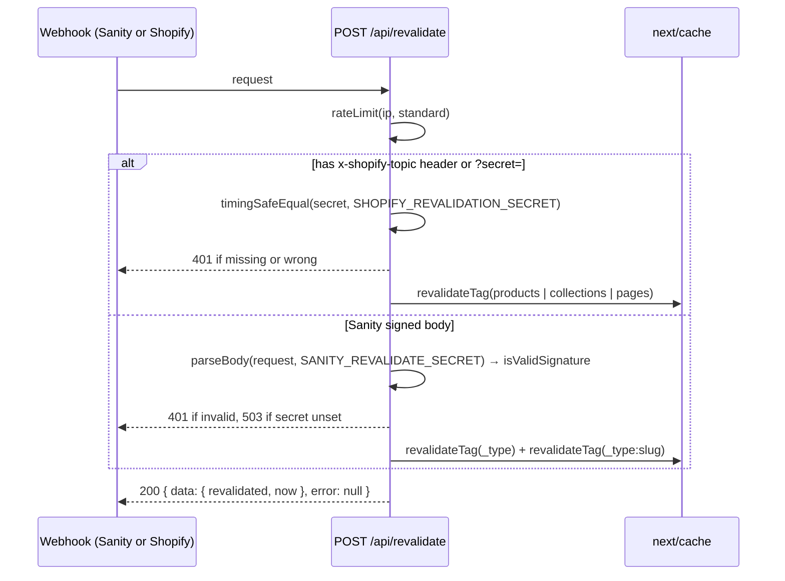

# API Routes

Server-side API endpoints for integrations and webhooks.

## Response Shape

Every JSON response follows `{ data, error }`: `error` is `null` and `data`
holds the payload on success; `data` is `null` and `error` is a message string
on failure. The HTTP status still carries the outcome (200 vs. 4xx/5xx) — the
body shape never changes based on it.

## Endpoints

| Route                     | Method | Purpose                                             |
| ------------------------- | ------ | --------------------------------------------------- |
| `/api/cart/ensure`        | POST   | Shopify: idempotently ensures a cart cookie exists  |
| `/api/draft-mode/enable`  | GET    | Enable Sanity draft mode                            |
| `/api/draft-mode/disable` | GET    | Disable Sanity draft mode                           |
| `/api/revalidate`         | POST   | Webhook for content revalidation (Sanity + Shopify) |

## Cart

### Ensure Cart

```
POST /api/cart/ensure
```

Gated on `isConfigured('shopify')` — returns 503 with
`{ data: null, error: 'Shopify is not configured' }` when Shopify isn't
configured. If the visitor already has a `cartId` cookie, it returns
`{ data: { ready: true }, error: null }` immediately. Otherwise it creates a
Shopify cart and sets it as an httpOnly cookie, then returns
`{ data: { ready: true }, error: null }`. If cart creation fails, it returns
`{ data: { ready: false }, error: 'Cart creation failed' }` with a 502 —
non-fatal to the caller, since `addItem` still creates a cart when the cookie
is missing. The cart id never reaches the client; the route reports only
presence.

Clients call this behind a cross-tab Web Lock so only one request is in
flight per browser, closing a race where two concurrent first-adds each
created their own cart.

## Draft Mode

Used by Sanity Visual Editing to preview unpublished content.

### Enable Draft Mode

Draft mode is enabled from Sanity Studio's Presentation tool, which generates
a signed preview link to `/api/draft-mode/enable` and validates it
server-side. A hand-built request (e.g. `?slug=/page-slug` without a valid
signature) returns 401 "Invalid secret".

### Disable Draft Mode

```
GET /api/draft-mode/disable
```

Clears draft mode cookies and redirects to homepage.

## Revalidation Webhook

A single endpoint receives both Sanity and Shopify webhooks and dispatches to the matching
provider's revalidation logic.

```
POST /api/revalidate
```

The route rate-limits by IP, then dispatches on the request's origin:



### Sanity Webhook Setup

1. Go to Sanity project settings → API → Webhooks
2. Create webhook with URL: `https://your-domain.com/api/revalidate`
3. Set secret in environment:

```bash
# .env.local
SANITY_REVALIDATE_SECRET=your-secret-here
```

The route uses `parseBody` from `next-sanity/webhook` to verify the Sanity signature.

### Shopify Webhook Setup

1. Go to Shopify Admin → Settings → Notifications → Webhooks
2. Create a webhook for each event (see `lib/integrations/shopify/README.md` for the full list)
   with URL: `https://your-domain.com/api/revalidate?secret=YOUR_SHOPIFY_REVALIDATION_SECRET`
3. Set secret in environment:

```bash
# .env.local
SHOPIFY_REVALIDATION_SECRET=your-secret-here
```

Shopify sends the webhook topic in the `x-shopify-topic` header and the secret as the `secret`
query param. The secret is compared in constant time (`timingSafeEqual`): missing or wrong
returns 401, otherwise 200 so Shopify does not retry.

## Security

- Webhooks require a secret token for authentication (`SANITY_REVALIDATE_SECRET`,
  `SHOPIFY_REVALIDATION_SECRET`)
- Rate limiting is applied to prevent abuse (429 on excess requests)
- Invalid Sanity signature returns 401; malformed body returns 400; unset secret returns 503
- Invalid or missing Shopify secret returns 401 (constant-time compare)
- Every JSON response is `{ data, error }`: `error` is null on success, a
  message string on failure

See also: [SECURITY.md](../../SECURITY.md)

## Adding New Endpoints

Create a new route file:

```tsx
// app/api/my-endpoint/route.ts
import { NextResponse } from 'next/server'

export async function POST(request: Request) {
  // Handle request
  return NextResponse.json({ data: { success: true }, error: null })
}
```
