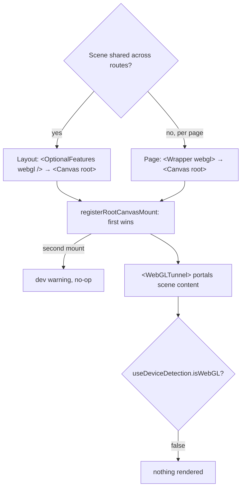

# WebGL / React Three Fiber

WebGL 2-accelerated 3D rendering with a persistent root canvas, built on
`@react-three/fiber`'s `WebGLRenderer`. GPU simulations (fluid, flowmap) run
as GLSL3 `RawShaderMaterial` passes.

## Quick Start

```tsx
import { Wrapper } from '@/components/layout/wrapper'
import { WebGLTunnel } from '@/webgl/components/tunnel'

export default function Page() {
  return (
    <Wrapper>
      <WebGLTunnel>
        <My3DScene />
      </WebGLTunnel>
      <section>HTML overlay</section>
    </Wrapper>
  )
}
```

The canvas is mounted with `<Canvas root>`, either once in the shared layout
(`lib/features`, via `<OptionalFeatures webgl />`) so it persists across route
navigation, or per page by passing `webgl` to the Wrapper (`<Wrapper webgl>`).
Pick exactly one — the store enforces a single root canvas at runtime, so if
both are mounted the first one wins and the second is a no-op (with a dev
warning), not a second canvas eating GPU.



### Perf: opting into GPU simulations

`<Canvas root>` mounts `FlowmapProvider` with no GPU simulations by default —
mounting a sim without a consumer wastes a render pass and window listeners.
Pass `simTypes` with the sims you actually use:

```tsx
<Canvas root simTypes={['flowmap']} />
```

## Device gating

The canvas is rendered only when `useDeviceDetection().isWebGL` is true (a
working WebGL2 context on a desktop viewport) AND the user does not prefer
reduced motion. On mobile, unsupported devices, or under
`prefers-reduced-motion` it's a no-op — nothing mounts. Rendering is driven
manually by the `RAF` component (`frameloop="never"`), not the default r3f
render loop.

> **Always ship a fallback.** Because reduced-motion (and non-WebGL devices)
> means the canvas may never mount, any page that puts _content_ in WebGL —
> not just decoration — must render a non-WebGL fallback (static image, DOM
> equivalent) for that state. If the WebGL content is essential and motionless,
> mount with `force` and damp motion inside the scene instead.

## Architecture

```
<Canvas root> (layout OR per-page Wrapper) → rendered only when isWebGL
    └─ WebGLTunnel.Out (portals 3D content from any page)
```

**Key benefits (shared/layout strategy):**

- Context persists across navigation (no recreation)
- Seamless route transitions
- Shared assets stay loaded
- No-op on non-WebGL devices

## Components

| Component     | Purpose                                                   |
| ------------- | --------------------------------------------------------- |
| `Canvas`      | Mounts the canvas via `root` (layout or per-page Wrapper) |
| `WebGLTunnel` | Portal 3D content into the canvas                         |
| `DOMTunnel`   | Portal HTML overlays                                      |

## Hooks

```tsx
import { useDeviceDetection } from '@/hooks/use-device-detection'
import { useWebGLElement } from '@/webgl/hooks/use-webgl-element'

// Sync a DOM element's rect into the scene (+ on-screen visibility)
const { setRef, rect, isVisible } = useWebGLElement()

// Gate rendering on capability
const { isWebGL } = useDeviceDetection()
```

`useWebGLRect` is the lower-level primitive (`useWebGLElement` is built on it):
it returns a stable getter for an element's current transform, for reading
inside a `useFrame` loop.

## DOM-Synced Component

```tsx
import { useWebGLElement } from '@/webgl/hooks/use-webgl-element'
import { WebGLTunnel } from '@/webgl/components/tunnel'

function WebGLBox({ className }) {
  const { setRef, rect, isVisible } = useWebGLElement()
  return (
    <div ref={setRef} className={className}>
      <WebGLTunnel>
        <MyMesh rect={rect} visible={isVisible} />
      </WebGLTunnel>
    </div>
  )
}
```
