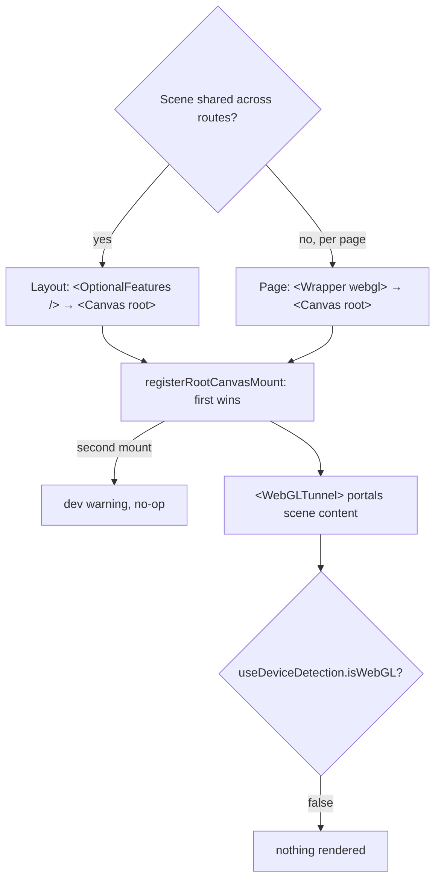

# WebGL / React Three Fiber

WebGL 2-accelerated 3D rendering with a persistent root canvas, built on
`@react-three/fiber`'s `WebGLRenderer`. GPU simulations (fluid, flowmap) run
as GLSL3 `RawShaderMaterial` passes.

## Quick Start

```tsx
import { Wrapper } from '@/components/layout/wrapper'
import { WebGLTunnel } from '@/webgl/components/tunnel'

export default function Page() {
  return (
    <Wrapper>
      <WebGLTunnel>
        <My3DScene />
      </WebGLTunnel>
      <section>HTML overlay</section>
    </Wrapper>
  )
}
```

A worked example lives at `app/(site)/(examples)/webgl` (`/webgl` in dev):
cubes that take their size and place from boxes CSS lays out, hold them
through scroll and resize, and follow a parallax transform published through
hamo's `TransformProvider`. Contributor-facing, noindex, and deleted by
`setup:project` with the rest of the examples group.

The canvas is mounted with `<Canvas root>`, either once in the shared layout
(`lib/features`: `<OptionalFeatures />` mounts it unconditionally) so it
persists across route navigation, or per page by passing `webgl` to the
Wrapper (`<Wrapper webgl>`) after removing it from the layout.
Pick exactly one — the store enforces a single root canvas at runtime, so if
both are mounted the first one wins and the second is a no-op (with a dev
warning), not a second canvas eating GPU.



### Perf: opting into GPU simulations

`<Canvas root>` mounts `FlowmapProvider` with no GPU simulations by default —
mounting a sim without a consumer wastes a render pass and window listeners.
Pass `simTypes` with the sims you actually use:

```tsx
<Canvas root simTypes={['flowmap']} />
```

## Device gating

The canvas is rendered only when `useDeviceDetection().isWebGL` is true (a
working WebGL2 context on a desktop viewport) AND the user does not prefer
reduced motion. On mobile, unsupported devices, or under
`prefers-reduced-motion` it's a no-op — nothing mounts. Rendering is driven
manually by the `RAF` component (`frameloop="never"`), not the default r3f
render loop.

> **Always ship a fallback.** Because reduced-motion (and non-WebGL devices)
> means the canvas may never mount, any page that puts _content_ in WebGL —
> not just decoration — must render a non-WebGL fallback (static image, DOM
> equivalent) for that state. If the WebGL content is essential and motionless,
> mount with `force` and damp motion inside the scene instead.

## Architecture

```
<Canvas root> (layout OR per-page Wrapper) → rendered only when isWebGL
    └─ WebGLTunnel.Out (portals 3D content from any page)
```

**Key benefits (shared/layout strategy):**

- Context persists across navigation (no recreation)
- Seamless route transitions
- Shared assets stay loaded
- No-op on non-WebGL devices

## Components

| Component     | Purpose                                                   |
| ------------- | --------------------------------------------------------- |
| `Canvas`      | Mounts the canvas via `root` (layout or per-page Wrapper) |
| `WebGLTunnel` | Portal 3D content into the canvas                         |
| `DOMTunnel`   | Portal HTML overlays                                      |

## Hooks

```tsx
import { useRect } from 'hamo'
import { useDeviceDetection } from '@/hooks/use-device-detection'
import { useWebGLRect } from '@/webgl/hooks/use-webgl-rect'

// DOM side: measure the element once per resize (hamo), pass the rect down.
const [setRectRef, rect] = useRect({ ignoreTransform: true })

// Canvas side: place a mesh on it, on Lenis scroll events, provider
// transform changes and re-measures.
useWebGLRect(rect, onUpdate)

// Gate rendering on capability
const { isWebGL } = useDeviceDetection()
```

`onUpdate` receives `{ position, scale, isVisible }` in the camera's units
(one unit per CSS pixel, origin mid-screen). Pass `ignoreTransform` to
`useRect` for an element that moves under a `TransformProvider`, whose
translate the hook adds itself. The hook works on either side of the tunnel:
in the mesh component its render effect places the mesh as soon as it
mounts; on the DOM side, where the mesh can mount later, the returned
`update` goes in the mesh's ref callback.

## DOM-Synced Component

```tsx
import { type Rect, useRect } from 'hamo'
import { useRef } from 'react'
import type { Mesh } from 'three'
import { useWebGLRect } from '@/webgl/hooks/use-webgl-rect'
import { WebGLTunnel } from '@/webgl/components/tunnel'

function WebGLBox({ className }) {
  const [setRectRef, rect] = useRect()
  return (
    <div ref={setRectRef} className={className}>
      <WebGLTunnel>
        <BoxMesh rect={rect} />
      </WebGLTunnel>
    </div>
  )
}

function BoxMesh({ rect }: { rect: Rect }) {
  const meshRef = useRef<Mesh>(null)
  useWebGLRect(rect, ({ position, scale, isVisible }) => {
    const mesh = meshRef.current
    if (!mesh) return
    mesh.position.copy(position)
    mesh.scale.copy(scale)
    mesh.visible = isVisible
  })
  return (
    <mesh ref={meshRef} visible={false}>
      <planeGeometry />
      <meshBasicMaterial />
    </mesh>
  )
}
```
